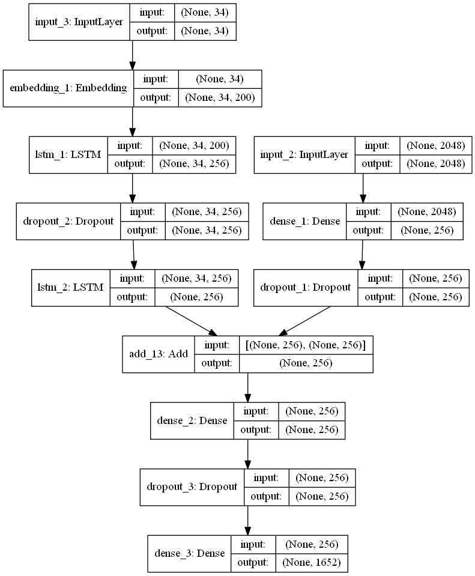

# Generating image captions using Xception Network and Beam Search

I tried to comment on the code as much as possible, it should be easy to follow. Feel free to use the trained model in your own projects. I have included the weight of the trained model. The model reaches the BLEU score of ~57% for 4-grams on test set, you can improve the score by training the model for longer durations or using a more sophisticated RNN with more layers. If you look at the examples below, you observe that the model is pretty good at recognizing the actions but makes some mistakes at recognising the colors. Beam search with beams of 1,3, and 5 have been tested. Also, I tried using sum of the log of probabilities in beam search and result imporoved a little bit for some samples of the test set as shown below.

### Examples of the outputs:

### Settings:

I have used a pretrained Xception network without the last two fully connected layers as the feature extractor. It outpus a 2048-d vector for each image, and this vector is fed into the LSTM network as the first activations. The LSTM network I used, consists of two layers of lstm units with 256-d hidden state. I used dropout between two lstm layers. The Flickr8k dataset has been used for train and evaluation of the Image Captioner.  Also attention technique can be used for producing the captions but I haven't tried here. I use Beam search for producing the captions.

### Model: 

### More on image captioning:

