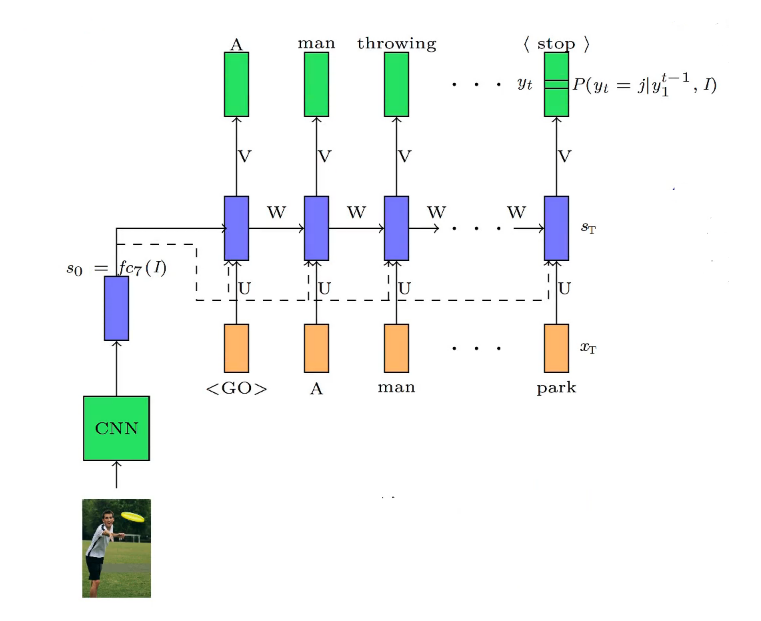
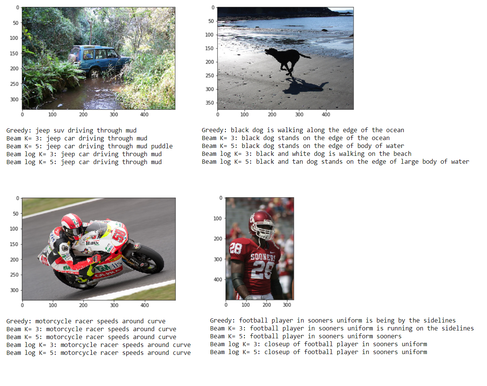

# Generating image captions using Xception Network and Beam Search

### Dataset:

The dataset consist of 8,000 images that are each paired with five different captions which provide clear descriptions of the salient entities and events. The images were chosen from six different Flickr groups, and tend not to contain any well-known people or locations, but were manually selected to depict a variety of scenes and situations. The images are divided into train set (6000 images), validation set(1000 images), and test set (1000 images).

You can download the data from here: https://academictorrents.com/details/9dea07ba660a722ae1008c4c8afdd303b6f6e53b
or here: https://github.com/jbrownlee/Datasets/releases

### Model: 

The encoder network is a pre-trained Xception network without the last two fully connected layers and it operates as a feature extractor. The decoder network consists of two layers of GRU units with 256-d hidden state. I used dropout with a rate of 0.4 between two GRU layers. Extracted features are 2048-d vectors for each image and are fed to the decoder alongside the input text at each step and as hidden state of the first GRU cell in the decoder. 

### Metric:

The primary programming task for a BLEU implementor is to compare n-grams of the candidate with the n-grams of the reference translation and count the number of matches. These matches are position-independent. The more the matches, the better the candidate translation is.

### Results:

The model reaches the BLEU score (explained in further section) of ~57% for uni-grams on test set, you can improve the score by training the model for longer durations or using a more sophisticated RNN with more layers. If you look at the examples below, you observe that the model is pretty good at recognizing the actions but makes some mistakes at recognising the colors. Beam search with beams of 1,3, and 5 have been tested. Also, I tried using sum of the log of probabilities in beam search and result imporoved a little bit for some samples of the test set as shown below. 
I have included the weight of the trained model, feel free to use the trained model in your own projects.

### More on image captioning:

I have recorded a **Farsi** tutorial explaining this code. You can find it here: https://www.aparat.com/v/BqVHt?playlist=338869

:notebook: [Show and Tell: A Neural Image Caption Generator](https://arxiv.org/abs/1411.4555)

:notebook: [Show, Attend and Tell: Neural Image Caption Generation with Visual Attention](https://arxiv.org/abs/1502.03044)

:notebook: [Automated Image Captioning with ConvNets and Recurrent Nets](https://cs.stanford.edu/people/karpathy/sfmltalk.pdf)
